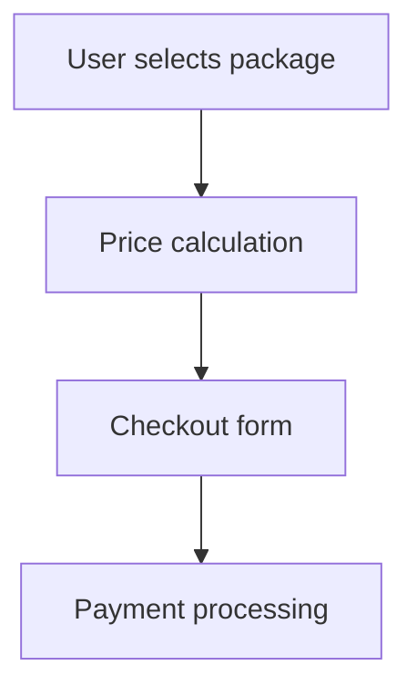

# 💳 Iyzico Payment System Setup

## 📋 Iyzico Merchant Account Setup

### 1. Merchant Başvurusu
1. [merchant.iyzico.com](https://merchant.iyzico.com) adresinden başvuru yapın
2. Gerekli belgeler:
   - **Kimlik Fotokopisi**
   - **İkametgah Belgesi** 
   - **Vergi Levhası** (şirket ise)
   - **İmza Sirküleri** (şirket ise)
   - **Website Screenshot'ları**

### 2. KYC (Know Your Customer) Süreci
- Telefon verification
- Adres verification  
- Business verification
- Website review (~3-5 iş günü)

### 3. API Keys Alma
Onay sonrası **Merchant Panel → Ayarlar → API Anahtarları**:
```
API Key: [your-production-api-key]
Secret Key: [your-production-secret-key]
Base URL: https://api.iyzipay.com
```

## 🔧 Environment Configuration

### Sandbox (Development)
```bash
IYZICO_BASE_URL=https://sandbox-api.iyzipay.com
IYZICO_API_KEY=sandbox-your-api-key  
IYZICO_SECRET_KEY=sandbox-your-secret-key
```

### Production
```bash
IYZICO_BASE_URL=https://api.iyzipay.com
IYZICO_API_KEY=your-production-api-key
IYZICO_SECRET_KEY=your-production-secret-key
```

## 🔐 Security Implementation

### 1. HMAC-SHA256 Authentication
Iyzico IYZWSv2 authentication zaten implement edilmiş:

```typescript
// lib/iyzico.ts
function generateAuthString(request: any, randomString: string): string {
  const payload = randomString + uriPath + JSON.stringify(request)
  const signature = crypto
    .createHmac('sha256', SECRET_KEY)
    .update(payload, 'utf8')
    .digest('hex')
  
  const authString = `apiKey:${API_KEY}&randomKey:${randomString}&signature:${signature}`
  return Buffer.from(authString, 'utf8').toString('base64')
}
```

### 2. Rate Limiting
API endpoint'ler korunmuş:
- **10 requests/minute** per IP
- **Duplicate booking** prevention (5 dakika)
- **Input validation** with Zod schemas

### 3. Error Handling
```typescript
// Graceful fallback to demo mode
if (!API_KEY || API_KEY === 'demo-api-key') {
  console.warn('⚠️ Using demo mode - Iyzico API keys not configured')
  return createDemoPaymentResponse(paymentRequest)
}
```

## 💰 Payment Flow

### 1. Package Selection


### 2. Payment Request Format
```typescript
interface PaymentRequest {
  conversationId: string        // Unique transaction ID
  price: string                // Package price (e.g., "150.00")
  paidPrice: string           // Same as price
  currency: "EUR"             // Euro currency
  basketId: string            // Booking ID
  
  paymentCard: {
    cardHolderName: string    // Card holder name
    cardNumber: string        // 16-digit card number
    expireMonth: string       // MM format
    expireYear: string        // YY format  
    cvc: string              // 3-4 digit CVC
  }
  
  buyer: {
    id: string               // Customer email as ID
    name: string             // First name
    surname: string          // Last name
    email: string            // Email address
    gsmNumber: string        // Phone (+90XXXXXXXXXX)
    identityNumber: string   // TC/Passport number
    registrationAddress: string
    ip: string               // Client IP
    city: string             // Istanbul
    country: string          // Turkey
  }
  
  basketItems: [{
    id: string               // Package ID
    name: string             // Package name
    category1: string        // "Photography"
    itemType: string         // "VIRTUAL"
    price: string           // Item price
  }]
}
```

### 3. Response Handling
```typescript
// Success response
{
  status: "success",
  paymentId: "12345678",
  conversationId: "booking_123",
  price: "150.00",
  currency: "EUR"
}

// Failure response  
{
  status: "failure", 
  errorCode: "5005",
  errorMessage: "Kart numarası geçersiz"
}
```

## 🧪 Testing

### Sandbox Test Cards
```
Success: 5528790000000008
- Expiry: 12/30
- CVC: 123
- 3D Secure: true

Failure: 5406675000000015  
- Always fails for testing

Insufficient Funds: 5406675000000023
- Simulates insufficient funds
```

### API Test Script
```bash
# Test payment initialization
curl -X POST https://sandbox-api.iyzipay.com/payment/auth \
  -H "Content-Type: application/json" \
  -H "Authorization: IYZWSv2 [auth-string]" \
  -d '{
    "conversationId": "test_123",
    "price": "150.00",
    "paidPrice": "150.00", 
    "currency": "EUR",
    // ... full payment request
  }'
```

## 🔄 Integration with Booking System

### 1. Payment Flow
```typescript
// app/api/booking/route.ts
export async function POST(request: NextRequest) {
  // 1. Validate booking data
  const validationResult = bookingSchema.safeParse(body)
  
  // 2. Create booking in Supabase
  const { data: booking } = await supabaseAdmin
    .from('bookings')
    .insert(bookingData)
    
  // 3. Return booking ID for payment
  return NextResponse.json({ booking })
}
```

### 2. Payment Processing
```typescript
// app/api/payment/initialize/route.ts
export async function POST(request: NextRequest) {
  // 1. Get booking details
  const booking = await getBookingById(bookingId)
  
  // 2. Initialize payment with Iyzico
  const paymentResult = await initializePayment(paymentRequest)
  
  // 3. Update booking status
  if (paymentResult.status === 'success') {
    await updateBookingStatus(bookingId, 'confirmed')
  }
  
  return NextResponse.json({ paymentResult })
}
```

## 📊 Commission & Pricing

### Iyzico Commission Rates
- **Domestic Cards:** 2.9% + ₺0.25
- **International Cards:** 3.5% + ₺0.25  
- **3D Secure:** Included
- **Monthly Fee:** No monthly fee

### Package Pricing (Including Commission)
```typescript
export const packagePrices = {
  essential: 150,    // €150 → ~€154.50 with fees
  premium: 280,      // €280 → ~€288.12 with fees  
  luxury: 450,       // €450 → ~€463.05 with fees
  rooftop: 150,      // €150 → ~€154.50 with fees
} as const
```

## 🚨 Error Handling & Monitoring

### 1. Common Error Codes
```typescript
const IYZICO_ERRORS = {
  '5001': 'Kart numarası geçersiz',
  '5002': 'Son kullanma tarihi geçersiz',
  '5003': 'CVC geçersiz', 
  '5004': 'Kart sahibi adı geçersiz',
  '5005': 'Yetersiz bakiye',
  '5006': 'İşlem limiti aşıldı',
  '5007': 'Kart bloke',
  '5008': '3D Secure doğrulama başarısız'
}
```

### 2. Logging Strategy
```typescript
console.log('🔐 Generated IYZWSv2 auth string for Iyzico API')
console.log('📡 Iyzico API response:', {
  status: result.status,
  errorCode: result.errorCode,
  errorMessage: result.errorMessage
})
```

### 3. Webhook Configuration
```typescript
// app/api/payment/webhook/route.ts
export async function POST(request: NextRequest) {
  // Verify webhook signature
  const signature = request.headers.get('x-iyzico-signature')
  
  // Process payment status updates
  const { conversationId, status } = await request.json()
  
  // Update booking status in database
  await updateBookingPaymentStatus(conversationId, status)
  
  return NextResponse.json({ success: true })
}
```

## 📋 Production Deployment Checklist

### Pre-Production
- [ ] Merchant account approved
- [ ] Production API keys obtained
- [ ] Webhook URL configured
- [ ] SSL certificate installed
- [ ] Payment flow tested in sandbox
- [ ] Error handling implemented

### Production Environment Variables
```bash
# Vercel Environment Variables
IYZICO_BASE_URL=https://api.iyzipay.com
IYZICO_API_KEY=[production-api-key]
IYZICO_SECRET_KEY=[production-secret-key]
```

### Post-Production
- [ ] Test payment with real card
- [ ] Monitor payment success rates
- [ ] Set up payment failure alerts
- [ ] Configure daily settlement reports
- [ ] Implement refund process

## 🔗 Webhook Setup

### 1. Merchant Panel Configuration
**Merchant Panel → Ayarlar → Webhook:**
```
Webhook URL: https://istanbulportrait.com/api/payment/webhook
Events: payment.success, payment.failure
```

### 2. Webhook Security
```typescript
function validateWebhookSignature(payload: string, signature: string): boolean {
  const expectedSignature = crypto
    .createHmac('sha256', IYZICO_SECRET_KEY)
    .update(payload)
    .digest('hex')
    
  return expectedSignature === signature
}
```

---

**💡 Important Notes:**
- Sandbox'da test edip production'a geçin
- API keys'leri asla GitHub'a commit etmeyin  
- Payment logs'ları düzenli olarak kontrol edin
- Refund process'ini implement etmeyi unutmayın
- PCI DSS compliance için kartbilgilerini store etmeyin